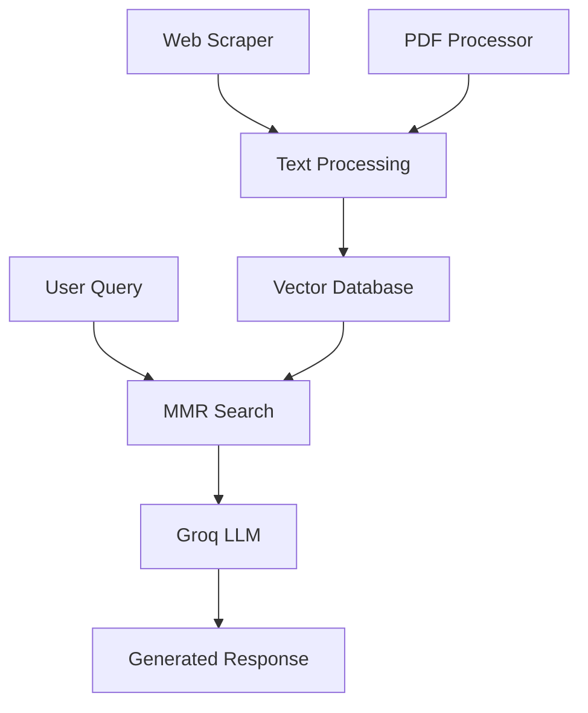

# AI Brand Moderator Bot

> **An intelligent AI-powered brand monitoring and content moderation system that combines web scraping, vector databases, and large language models to provide real-time brand intelligence and automated query responses.**

[](https://python.org)
[](https://fastapi.tiangolo.com)
[](https://reactjs.org)
[](https://groq.com)
[](https://www.trychroma.com)

## 🚀 Overview

The AI Brand Moderator Bot is a sophisticated multimodal AI application designed to revolutionize brand monitoring and content analysis. By leveraging cutting-edge technologies including vector databases, large language models, and intelligent web scraping, this system provides businesses with real-time insights into their brand perception and automated responses to brand-related queries.

## ✨ Key Features

### 🔍 **Intelligent Web Scraping**
- **Recursive Brand Website Analysis**: Automatically discovers and scrapes brand-related content across multiple pages
- **Priority URL Detection**: Smart identification of important brand pages (about, products, services)
- **Content Deduplication**: Advanced hashing prevents duplicate content storage

### 🧠 **Advanced AI Processing**
- **Vector Database Integration**: Uses Chroma DB for efficient semantic search and retrieval
- **Large Language Model**: Powered by Groq's Llama3-8b-8192 for fast, accurate responses
- **Maximum Marginal Relevance (MMR)**: Ensures diverse and relevant content retrieval

### 📄 **Document Processing**
- **PDF Upload Support**: Extract and process text content from brand documents
- **Multi-format Content**: Handles various document types for comprehensive brand analysis
- **Intelligent Text Chunking**: Optimized text segmentation for better context retrieval

### 🌐 **Modern Web Interface**
- **React-based Frontend**: Built with React 19 and Vite for optimal performance
- **Dynamic Brand Pages**: Customizable interfaces for different brands
- **Real-time Query Processing**: Instant responses to brand-related questions

## 🛠️ Technology Stack

### Backend Infrastructure
| Technology | Purpose | Version |
|------------|---------|---------|
| **FastAPI** | REST API Framework | Latest |
| **Python** | Core Backend Language | 3.8+ |
| **ChromaDB** | Vector Database | Latest |
| **LangChain** | LLM Integration Framework | Latest |
| **BeautifulSoup4** | Web Scraping Engine | Latest |
| **Groq API** | LLM Inference (Llama3-8b) | Latest |

### Frontend Technologies
| Technology | Purpose | Version |
|------------|---------|---------|
| **React** | Frontend Framework | 19.1.0 |
| **Vite** | Build Tool | 6.3.5 |
| **Axios** | HTTP Client | 1.9.0 |
| **React Router** | Client-side Routing | 7.6.0 |

### AI & Machine Learning
- **Sentence Transformers**: Text embedding generation
- **HuggingFace Models**: Pre-trained transformer models
- **Groq LPU**: Ultra-fast inference with Language Processing Units
- **PyPDF**: PDF text extraction capabilities

## 📋 Prerequisites

Before installation, ensure you have:

- **Python 3.8+** installed
- **Node.js 16+** and npm/yarn
- **Groq API Key** (Sign up at [Groq Console](https://console.groq.com))
- **Git** for repository management

## 🚀 Quick Start Guide

### 1. Repository Setup
```bash
# Clone the repository
git clone https://github.com/kevin-joshua/AI_BRAND_MODERATOR_BOT.git
cd AI_BRAND_MODERATOR_BOT
```

### 2. Backend Configuration

#### Environment Setup
```bash
# Create virtual environment
python -m venv venv

# Activate virtual environment
# On Windows:
venv\Scripts\activate
# On macOS/Linux:
source venv/bin/activate

# Install dependencies
pip install -r requirements.txt
```

#### Environment Variables
Create a `.env` file in the root directory:
```env
GROQ_API_KEY=your_groq_api_key_here
HUGGINGFACE_TOKEN=your_huggingface_token_here
```

#### Launch Backend Server
```bash
python main.py
# or
uvicorn main:app --reload --host 0.0.0.0 --port 8000
```

The API will be available at `http://localhost:8000`

### 3. Frontend Setup

```bash
# Navigate to frontend directory
cd frontend

# Install dependencies
npm install

# Start development server
npm run dev
```

The frontend will be available at `http://localhost:5173`

## 📊 API Documentation

### Core Endpoints

#### **Brand Scraping**
```http
POST /scrape
Content-Type: application/json

{
  "url": "https://example-brand.com"
}
```
**Response**: Initiates comprehensive brand website scraping and vector database population.

#### **Document Upload**
```http
POST /upload_pdf
Content-Type: multipart/form-data

files: [PDF files...]
```
**Response**: Processes and integrates PDF documents into the brand knowledge base.

#### **Brand Query**
```http
GET /query?brand={brand_name}&query={user_question}
```
**Response**: Returns AI-generated responses based on scraped brand content.

### API Features
- **CORS Support**: Cross-origin requests enabled for frontend integration
- **Error Handling**: Comprehensive error responses with detailed messages
- **Rate Limiting**: Built-in protection against API abuse
- **Validation**: Input validation for all endpoints

## 💻 Usage Examples

### 1. Brand Setup Workflow
```python
import requests

# Step 1: Scrape brand website
response = requests.post("http://localhost:8000/scrape", 
                        json={"url": "https://apple.com"})

# Step 2: Upload additional documents
files = {'pdfFiles': open('brand_guidelines.pdf', 'rb')}
response = requests.post("http://localhost:8000/upload_pdf", files=files)

# Step 3: Query brand information
response = requests.get("http://localhost:8000/query", 
                       params={"brand": "apple", "query": "What are Apple's core values?"})
print(response.json()["answer"])
```

### 2. Frontend Integration
```jsx
// Brand query component example
const queryBrand = async (brand, question) => {
  const response = await axios.get(`/query`, {
    params: { brand, query: question }
  });
  return response.data.answer;
};
```

## 🏗️ Architecture Overview

### System Components



### Data Flow Architecture

1. **Data Ingestion**: Web scraping and PDF processing collect brand content
2. **Text Processing**: Content is chunked and converted to vector embeddings
3. **Storage**: Embeddings stored in ChromaDB with metadata
4. **Retrieval**: MMR search finds relevant content for user queries
5. **Generation**: Groq's Llama3 generates contextual responses
6. **Delivery**: Responses delivered through FastAPI to React frontend

### Vector Database Schema

```python
# Document structure in ChromaDB
{
    "page_content": "Brand content text...",
    "metadata": {
        "hash": "unique_content_hash",
        "source": "website|pdf",
        "timestamp": "2024-01-01T00:00:00"
    }
}
```

## ⚙️ Configuration Options

### Backend Configuration
```python
# main.py configuration variables
MAX_DEPTH = 3  # Website scraping depth
MAX_PAGES = 50  # Maximum pages to scrape
MAX_TOKENS = 4000  # Token limit for LLM context
CHUNK_SIZE = 512  # Text chunk size
CHUNK_OVERLAP = 50  # Overlap between chunks
```

### Vector Search Parameters
```python
# MMR search configuration
k = 4  # Number of documents to return
fetch_k = 15  # Documents to fetch before MMR selection
lambda_mult = 0.5  # Diversity vs relevance balance
```

### LLM Settings
```python
# Groq API configuration
model = "llama3-8b-8192"
temperature = 0.3  # Response creativity level
max_tokens = 1000  # Maximum response length
```


### Development Mode
```bash
# Backend with auto-reload
uvicorn main:app --reload

# Frontend with hot reload
npm run dev
```

### API Testing
Use the built-in FastAPI documentation:
- Open `http://localhost:8000/docs` for Swagger UI
- Open `http://localhost:8000/redoc` for ReDoc

## 🔒 Security Considerations

### API Security
- **API Key Management**: Secure storage of Groq and HuggingFace tokens
- **CORS Configuration**: Restricted to specific origins in production
- **Input Validation**: Comprehensive validation for all endpoints
- **Rate Limiting**: Protection against API abuse

### Data Privacy
- **Local Storage**: Vector database stored locally by default
- **Content Hashing**: Prevents duplicate data storage
- **Temporary Files**: Automatic cleanup of uploaded documents

## 🚀 Deployment

### Production Deployment

#### Docker Configuration
```dockerfile
# Dockerfile example
FROM python:3.9-slim

WORKDIR /app
COPY requirements.txt .
RUN pip install -r requirements.txt

COPY . .
EXPOSE 8000

CMD ["uvicorn", "main:app", "--host", "0.0.0.0", "--port", "8000"]
```

#### Environment Variables for Production
```env
GROQ_API_KEY=your_production_key
HUGGINGFACE_TOKEN=your_production_token
CORS_ORIGINS=https://yourdomain.com
DATABASE_URL=your_production_db_url
```

### Cloud Deployment Options
- **AWS**: EC2, ECS, or Lambda deployment
- **Google Cloud**: App Engine or Cloud Run
- **Azure**: Container Instances or App Service
- **Heroku**: Direct deployment with buildpacks

## 📝 License

This project is licensed under the MIT License. See [LICENSE](LICENSE) file for details.
